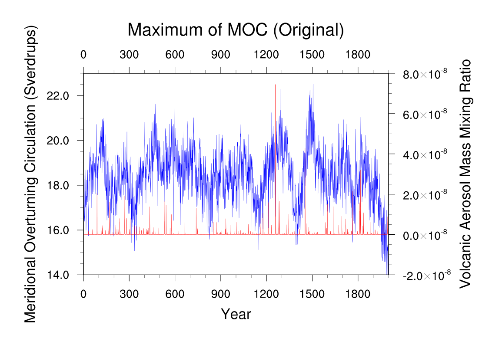
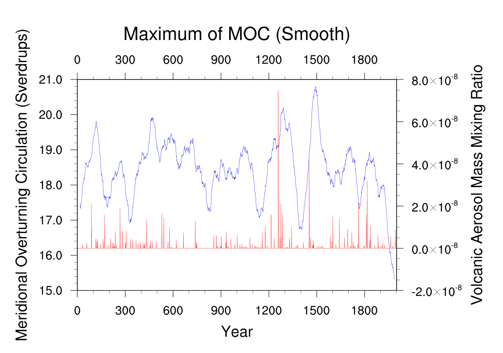
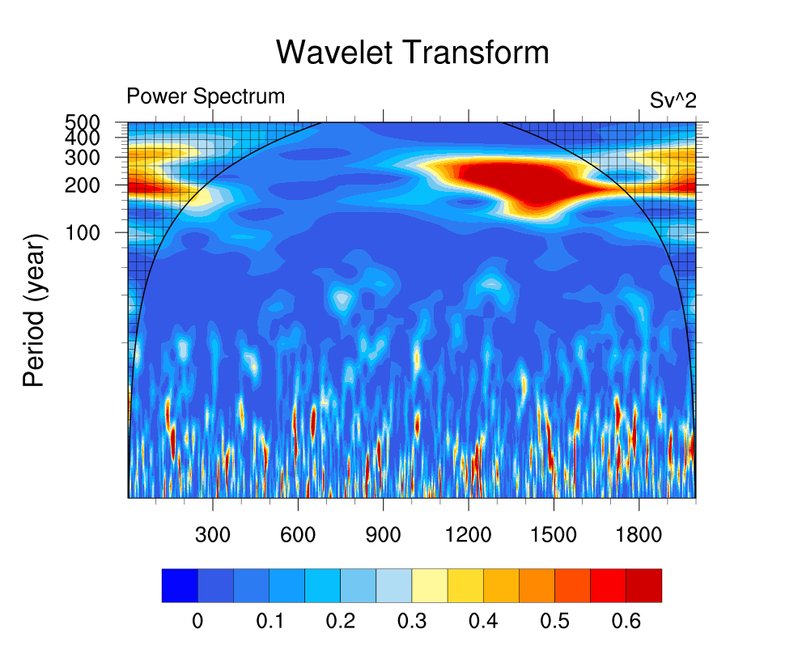
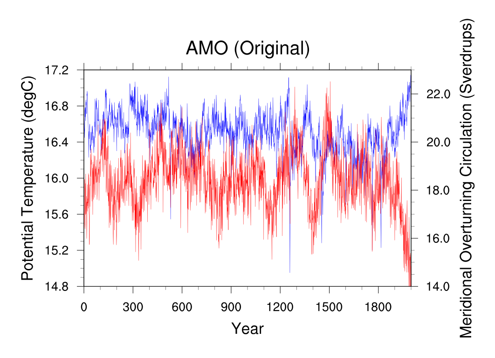
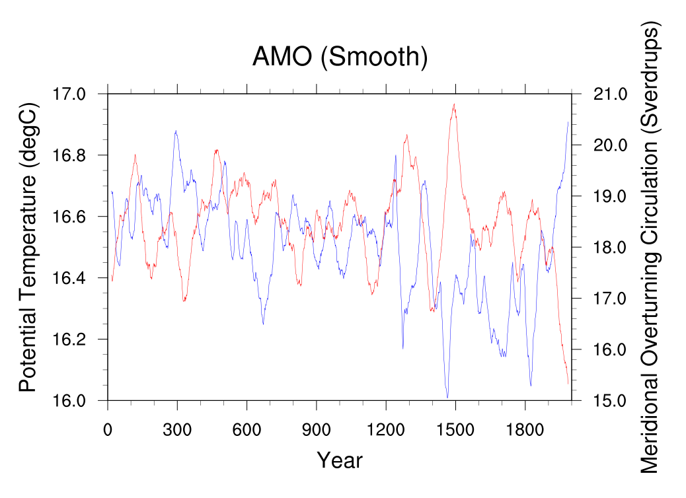

GetMoc
======
This project can get the meridional overturning circulation (MOC) from MASK (Output data from CESM 1.0.3) and calculate the annual mean series of MOC. I use it to calculate the Atlantic meridional overturning circulation (AMOC).

This tool base on NCL (NCAR Command Language), run on Linux. First, enter the root directory of GetMoc, do "bash main.sh".

Then, wait for some time, this tool can draw several pictures of AMOC, AMO (Atlantic multidecadal oscillation) and so on from five climatic modeling experiments of CESM.

For example, AMOC from All Forcings experiment:

AMO from All Forcings experiment:

The Fortran project isn't mine, I add it in this project only for test the output data of NCL project.
